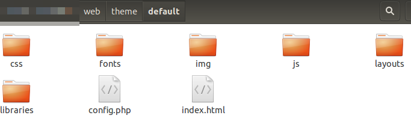

<!--toc=themes_toc-->

# テーマ

> [[PRODUCTNAME]]は本テーマの拡張機能により、実装しています。

CMS にはテーマシステムがあり、開発者はテーマを作成して `web/theme/custom` フォルダに追加することで、アプリケーションのルック＆フィールをカスタマイズすることができます。テーマエンジンは継承の原則を念頭に置いて設計されています。つまり、CMS がリクエストしたリソースは現在アクティブなテーマを経由し、もしそのテーマがリソースを含んでいなければ、デフォルトのテーマリソースが提供されます。このため、各テーマは**必要な項目だけ**を調整すればよく、デフォルトのテーマを丸ごとコピーする必要はありません。

テーマは `/theme/custom` フォルダの下にあるサブフォルダとしてモデル化されます。テーマフォルダは、`/web` CMSインストールフォルダに含まれます。デフォルトのテーマは`defaultというフォルダの中に存在します。

デフォルトのテーマの構造は以下のとおりです。



各テーマは`config.php`というシンプルな設定ファイルを持ち、テーマのタイトルやその他のメタデータを設定します。例えば、デフォルトテーマの`config.php`は次のようになっています。

```
<?php
$config = array(
    'theme_name' => 'Xibo Default Theme',
    'theme_title' => 'Xibo Digital Signage',
    'app_name' => 'Xibo',
    'theme_url' => 'http://xibo.org.uk',
    'cms_source_url' => 'https://github.com/xibosignage/xibo/',
    'cms_install_url' => 'http://xibo.org.uk/manual/en/install_windows_client.html'。
    'cms_release_notes_url' => 'http://xibo.org.uk/manual/en/release_notes.html'
);
```

現在のCMSテーマは、CMS全般の設定で有効になっており、`[[PRODUCTNAME]]`という名前になっています。デフォルトのテーマです。このリストは、`/theme/custom`内のフォルダに対して有効な`config.php`ファイルが存在する場合に自動的に生成されます。


## 基本的な変更

テーマの基本的な変更、例えばCSSへの小さな変更は、テーマの`/web/theme/custom/<theme>/css`フォルダに`override.css`ファイルを提供することで実現できます。このCSSファイルは、すべてのページの**最後**のCSSインクルードとして含まれ、CSSを上書きするために使用することができます。このファイルのデフォルトバージョンは空です。

また、HTMLでレンダリングするすべてのウィジェット（埋め込み、ティッカーなど）に適用される`client.css`ファイルをインクルードすることができます。これは、すべてのディスプレイにグローバルブランディングを適用するのに便利です。

## 高度な変更

CMSのビジュアルユーザーインターフェースのほぼ全ての部分を変更することができます。

CMS はビューレイヤーに **Twig** エンジンを使用しており、すべてのビューが `/views` ルートフォルダに格納されています。各Twigビューは、theme `config.php`ファイルで`view_path`の代替設定を行うことでオーバーライドすることができます。例えば

```
$config['view_path'] = PROJECT_ROOT . '/custom/<theme>/views/';
```

カスタムビューをテーマフォルダ自体に保存することも可能です。この場合、Xibo のインストールルートを指すグローバル定数 `PROJECT_ROOT` を使用しなければなりません。

> このようにすることも可能ですが、以下の内容は CMS を変更するのではなく、CMS を拡張するための有用な情報として扱うことをお勧めします。コアとなるナビゲーションやページ、フォームを上書きすると、ソフトウェアの新しいバージョンにきれいにアップグレードできなくなります。

### ナビゲーション

CMSのナビゲーションバーは`authed-sidebar.twig`で定義され、`authed.twig`に含まれています。

### ページ

CMSのすべてのページは`authed.twig`ファイルを継承し、さらに`base.twig`ファイルを継承しています。これらのファイルのいずれかをオーバーライドすることで、CMSのHTML/CSSのカスタマイズを開始することができます。

### フォーム
Xibo のフォームは XHR で提供され、ブラウザで JavaScript によって描画されます。各フォームは `form_base.twig` ファイルを継承しています。

## Docker

Dockerコンテナには、上記の`/custom`フォルダの場所すべてにあらかじめマウントされたボリュームが同梱されています。これらのボリュームにファイルを追加することで、Xiboからファイルを利用できるようになります。

## 例

###ロゴを変更する

典型的な使用例として、ヘッダーに表示されるロゴを変更することがあります。この例では、まだテーマがないことを想定しています。以下のような構成で作成します。

- `web/theme/custom` フォルダが存在しない場合は作成します。
- `web/theme/custom/mytheme` のように、テーマ用のサブフォルダを作成します。

次に、テーマの設定ファイルを `/web/theme/custom/mytheme/config.php` に用意する必要があります。

```
<?php
$config = array(
    'theme_name' => 'My Theme',
    'theme_title' => 'My Theme',
    'app_name' => 'Xibo',
    'theme_url' => 'http://xibo.org.uk',
    'cms_source_url' => 'https://github.com/xibosignage/xibo/'。
    'cms_install_url' => 'http://xibo.org.uk/manual/en/install_windows_client.html'。
    'cms_release_notes_url' => 'http://xibo.org.uk/manual/en/release_notes.html'
);
```

新しいテーマは、CMS設定の「設定」タブで有効にすることができます。今すぐそうしてください。

CMS は、画像、CSS、JavaScript を含むすべてのリソースについて、テーマフォルダをチェックするようになります。つまり、代わりのロゴをテーマにドロップすれば、それを代わりにレンダリングしてくれるのです。

デフォルトのロゴは `/web/theme/default/img/xibologo.png` に保存されています。そのコピーを取って `/web/theme/custom/mytheme/img/xibologo.png` に保存し、あなたの必要性に応じて変更してください。

## 新しいリンクの追加
よくある例は、ユーザーを外部のウェブページに誘導する新しいリンクをメニューに追加することです。この例では、「ロゴの変更」の例で示したテーマを作成したと仮定しています。

新しいリンクを提供するためには、CMS がそのコンテンツをレンダリングするために使用する Twig ビューの一つをオーバーライドする必要があります。

`config.php` ファイルの `$config` 配列にカスタムビューパスを追加してください。

```
$config['view_path'] => PROJECT_ROOT . '/web/theme/custom/mytheme/views',
```

例えば `/views/authed-sidebar.twig` をコピーして `view_path` に保存し、html の適切な場所に新しいリンクを追加してください。
